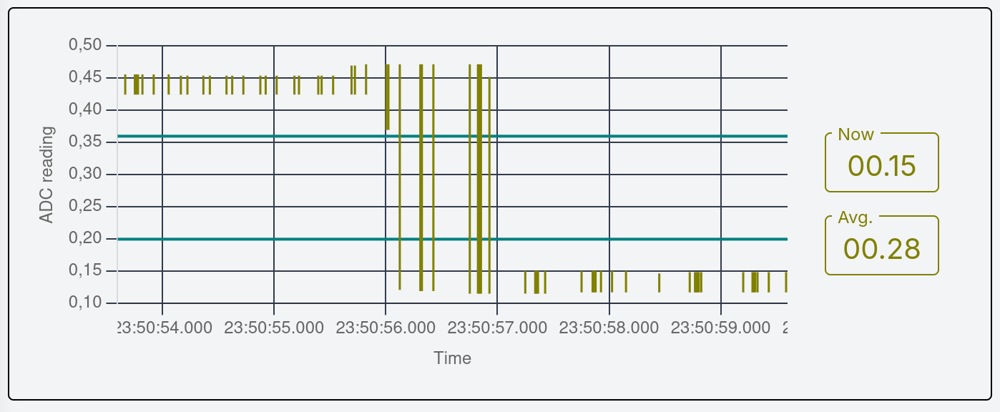
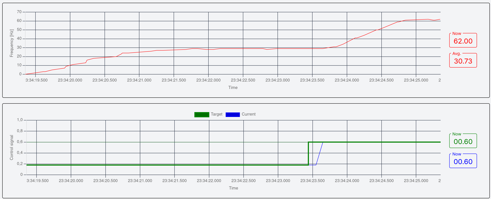
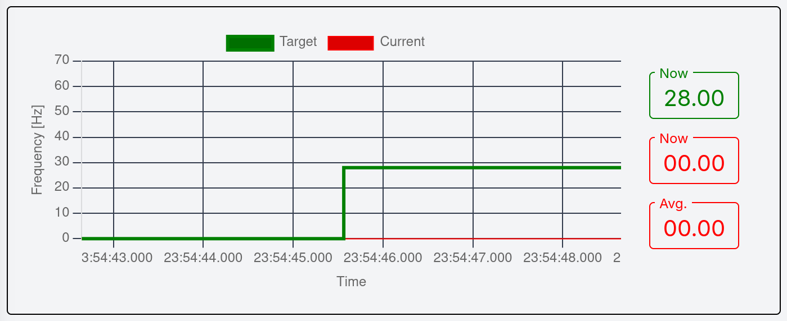

# Master thesis project

## Platform

This software was tested on Linux. It should work on other platforms thanks to
docker, but might require additional setup.

## Requirements

For native and docker build:

- [`git`](https://git-scm.com/)
- [`task`](https://github.com/go-task/task)
- [`uv`](https://github.com/astral-sh/uv)
- [`docker`](https://www.docker.com/)
- [`node>=1.18.0`](https://nodejs.org)
- [`espflash^3.3.0`](https://github.com/esp-rs/espflash)
- [`ssh`](https://www.openssh.com/)
- [`rsync`](https://linux.die.net/man/1/rsync)
- mDNS name resolution setup (e.g. [`avahi`](https://avahi.org/) on linux)

For native build additionally:

- [`rustup`](https://github.com/rust-lang/rustup)
- [`zvm`](https://github.com/tristanisham/zvm)
- [`cmake>=4.0.0`](https://github.com/Kitware/CMake)
- [`npm`](https://www.npmjs.com/)
- esp-idf requirements:
  - [`python3`](https://www.python.org/)
  - [`ldproxy`](https://github.com/esp-rs/embuild/tree/master/ldproxy) (`cargo
install ldpoxy --locked`)
  - rest specified [on the espressif
    website](https://docs.espressif.com/projects/esp-idf/en/latest/esp32/get-started/linux-macos-setup.html#step-1-install-prerequisites).

## Building

All binary artifacts are placed under the `./artifacts/` directory.

### Docker

```sh
BUILD_IN_DOCKER=true task build
```

### Native

```sh
BUILD_IN_DOCKER=false task build
```

## Running

1. Build a circuit using one of the provided schematics from
   [](./docs/circuits).
2. Ensure that the software and hardware is correctly configured (see
   #Configuration).
3. Run

   ```sh
   task scenarios-run PROJECT=<project> LANG=<lang> [PROFILE=<profile>]
   ```

   e.g.

   ```sh
   task scenarios-run PROJECT=1-blinky-os LANG=c
   ```

   Suffix `-os` indicates that the program is for Raspberry Pi while suffix
   `-bm` -- for ESP32.

> [!NOTE]  
> The third scenario `3-pid` requires additional setup. See #Scenario-3-pid-setup.

## Scenario `3-pid` setup

The third scenario is unique, since apart from software running on the MPU/MCU,
it also requires a controller dashboard server running on the host machine. The
server cannot run in docker, as it needs access to mDNS resolution daemon.

### Tuning

Apart from that, the third scenario will most likely require additional tuning
and will not work out-of-the-box, because of differences in HAL sensor
sensitivity, magnet strength and distance between them. To tune, do the
following steps.

1. Start the dashboard server.

   ```sh
   task server-run
   ```

2. Flash the ESP32 with the tuning program.

   ```sh
   task scenarios-3-pid-tune
   ```

3. Visit [](http://localhost:3000).
4. Navigate to the **Tune** page.
5. Look at the _ADC reading_ plot. You should see vertical lines drawn here;
   each line indicates a range of values that came out of the ADC in a certain
   time window prior to the line (top end -- maximum, bottom end -- minimum of the
   values in the time window).
6. Tune the _Threshold close_ and _Threshold far_ controls in the parameter
   panel on the bottom of the page. To do that, first position the magnet in
   the furthest possible position from the HAL sensor and then in the closest.
   Choose such thresholds so to cover a band between readings at the two extreme
   positions of the magnet, like in the picture below. Note that the closer
   the magnet to the HAL sensor, the lower should be the reading. If it works in
   the opposite way, turn the HAL sensor 180 degrees.

   

   > [!NOTE]  
   > The parameter panel is hidden, if the navbar is open. Close tha navbar to
   > see the parameter panel.

7. Each time there is a reading below _Threshold close_ followed by a reading
   above _Threshold far_, a new revolution is counted (hysteresis). This is how
   the frequency is calculated, that you can see in the _Frequency_ plot below.
8. Finally, you can alternate the control signal on the _Control signal_ dial,
   or on the bottommost plot. When you increase the control signal value, the
   frequency should follow like in the picture below. You can use a
   spectrometer (e.g. in a smartphone app) to verify that the frequency is
   correct.

   

9. Now enter the _Threshold close_ and _Threshold far_ values into the `.env`
   configuration file as respectively `REVOLUTION_THRESHOLD_CLOSE` and
   `REVOLUTION_THRESHOLD_FAR`.

### Operating the controller

1. Start the dashboard server.

   ```sh
   task server-run
   ```

2. Flash the ESP32 with the chosen implementation of the program like in
   #Running, e.g.:

   ```sh
   task scenarios-run PROJECT=3-pid LANG=c
   ```

3. Visit [](http://localhost:3000).
4. Navigate to the **Control** page.
5. Look at the _Frequency_ plot. Here you can set the target frequency that the
   motor controller is to maintain (green line).

   

6. The red line on the plot above indicates the current frequency as seen by
   the controller. As you can see, nothing happened after changing the target
   frequency. This is due to the fact that all the PID control parameters are
   initially set to zero. To enable and set the parameters, use the panel on
   the bottom of the page (see the picture below).

   

   > [!NOTE]  
   > The parameter panel is hidden, if the navbar is open. Close tha navbar to
   > see the parameter panel.

7. After properly tuning the control parameters, the controller should now
   follow the set target frequency, like in the picture below.

   

## Benchmarking

1. Build a circuit using one of the provided schematics from
   [](./docs/circuits).
2. Ensure that the hardware is correctly configured (see #Configuration).
3. Make sure the connection to the device works:
   - (Raspberry Pi) Ensure that Raspberry Pi is reachable at `mst.local`.
   - (ESP) Ensure that ESP is plugged into an USB port of the computer and the
     `USB_VENDOR/PRODUCT` are properly configured.
4. Run:

   ```sh
   task bench:<project>
   ```

   e.g.

   ```sh
   task bench:1-blinky-os
   ```

The results are then written to the `./analyze/out/perf/` directory.

## Configuration

Configuration is done through a `.env` file in the root of the repository. It
can be created using the defaults: `cp .default.env .env`.

### Build configuration

- `REVOLUTION_THRESHOLD_CLOSE` -- For the third scenario. ADC reading
  threshold, below which the magnet is considered to be close. Used for
  calculating the frequency. Obtained through tuning procedure, described in
  #Tuning.
- `REVOLUTION_THRESHOLD_FAR` -- For the third scenario. ADC reading threshold,
  above which the magnet is considered to be far. Used for calculating the
  frequency. Obtained through tuning procedure, described in #Tuning.
- `WIFI_SSID` -- For the third scenario on ESP32. SSID of WiFi network to
  connect to.
- `WIFI_PASS` -- For the third scenario on ESP32. Password of WiFi network to
  connect to.

### Runtime configuration

- `ESPFLASH_PORT` -- USB device used to flash ESP programs. If left empty,
  `espflash` will find it automatically (slower).
- `ESPFLASH_BAUD=115200` -- baud rate for flashing ESP programs. If left empty,
  `espflash` will pick the safest (slowest) possible option.
- `USB_VENDOR` -- ESP USB port vendor identifier, on how
  to get this. Required for benchmarking on ESP. See [esp-rs
  documentation](https://docs.esp-rs.org/std-training/02_1_hardware.html) for
  information on how to set this value.
- `USB_PRODUCT` -- ESP USB port product identifier. Required for benchmarking
  on ESP. See [esp-rs
  documentation](https://docs.esp-rs.org/std-training/02_1_hardware.html) for
  information on how to set this value.

### ESP32 hardware configuration

ESP32 does not require additional configuration, besides the build
configuration described in #Build-configuration.

### Raspberry Pi hardware configuration

Raspberry Pi must configured directly in its operating system. Ensure the
Raspberry Pi peripherals and modules are correctly configured:

- GPIO,
- I2C,
- Hardware PWM,
- mDNS server with address: 'mst.local',
- WiFi.

For help, refer to [Raspberry Pi documentation](https://www.raspberrypi.com/documentation/).
