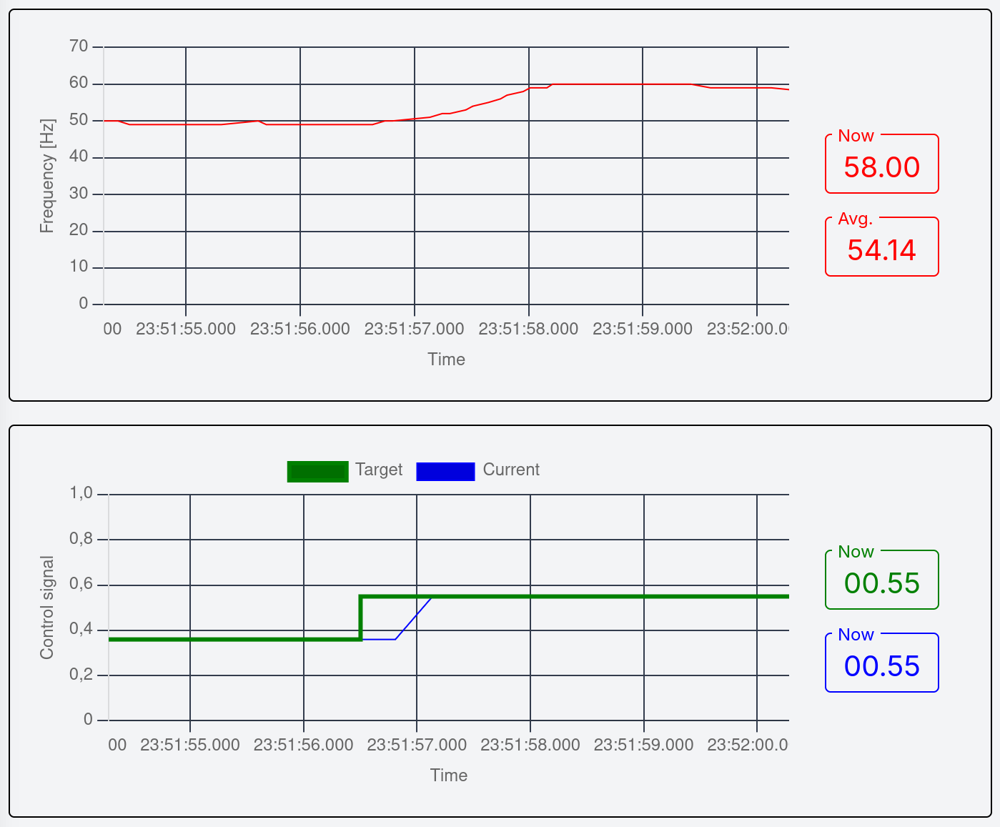

# Master thesis project

## Platform

This software was tested on Linux. It should work on other platforms thanks to
docker, but might require additional setup.

## Requirements

For native and docker build:

- [`git`](https://git-scm.com/)
- [`task`](https://github.com/go-task/task)
- [`uv`](https://github.com/astral-sh/uv)
- [`docker`](https://www.docker.com/)
- [`node>=1.18.0`](https://nodejs.org)
- mDNS name resolution setup (e.g. [`avahi`](https://avahi.org/) on linux)

For native build additionally:

- [`rustup`](https://github.com/rust-lang/rustup)
- [`zvm`](https://github.com/tristanisham/zvm)
- [`cmake>=4.0.0`](https://github.com/Kitware/CMake)
- [`npm`](https://www.npmjs.com/)
- esp-idf requirements:
  - [`python3`](https://www.python.org/)
  - [`ldproxy`](https://github.com/esp-rs/embuild/tree/master/ldproxy) (`cargo
install ldpoxy --locked`)
  - rest specified [on the espressif
    website](https://docs.espressif.com/projects/esp-idf/en/latest/esp32/get-started/linux-macos-setup.html#step-1-install-prerequisites).

## Building

All binary artifacts are placed under the `./artifacts/` directory.

### Docker

```sh
BUILD_IN_DOCKER=true task build
```

### Native

```sh
BUILD_IN_DOCKER=false task build
```

## Running

Regardless of platform, before running the code you must:

1. Build a circuit using one of the provided schematics from
   [](./docs/circuits).
2. Ensure that the hardware is correctly configured (see #Configuration).

### Raspberry Pi

1. Copy selected artifact to Raspberry Pi's SD card.
2. SSH into the board.

   ```sh
   ssh raspberrypi.local
   ```

3. Run the selected artifact.

> [!NOTE]  
> The third scenario `3-pid` requires additional setup. See #Scenario-3-pid-setup

### ESP

1. Attach the ESP using a cable to the computer.
2. Run

   ```sh
   task <language>:run-bm PROJECT=<project>
   ```

   e.g.

   ```sh
   task c:run-bm PROJECT=1-blinky-bm
   ```

   to run the C implementation of `1-blinky-bm`.

## Scenario `3-pid` setup

The third scenario is unique, since apart from software running on the MPU/MCU,
it requires a controller dashboard server running on the host machine. The
server cannot run in docker, as it needs access to mDNS resolution daemon.

### Tuning

Apart from that, the third scenario will most likely require additional tuning
and will not work out-of-the-box, because of differences in HAL sensor
sensitivity, magnet strength and distance between them. To tune, do the
following steps.

1. Start the dashboard server.

   ```sh
   task server-run
   ```

2. Flash the ESP32 with runing program.

   ```sh
   task scenarios-3-pid-tune
   ```

3. Visit [](http://localhost:3000).
4. Go to the **Tune** page.
5. Look at the _ADC reading_ plot. You should see vertical lines drawn here;
   each line indicates a range of values that came out of the ADC in a certain
   time window prior to the line (top end -- maximum, bottom end -- minimum of the
   values in the time window).
6. Position the magnet in the furthest possible position from the HAL sensor
   and then in the closest. Manipulate the _Threshold close_ and _Threshold far_
   controls on the bottom bar of the site to cover a band between these two
   extremes, like in the picture below.

   

7. Each time there is a reading below _Threshold close_ followed by a reading
   above _Threshold far_, a new revolution is counted (hysteresis). This is how
   the frequency is calculated, that you can see in the _Frequency_ plot below.
8. Finally, you can alternate the control signal on the _Control signal_ dial,
   or on the bottommost plot. When you increase the control signal value, the
   frequency should follow like in the picture below. You can use a
   spectrometer (e.g. in a smartphone app) to verify that the frequency is
   correct.

   

9. Now enter the _Threshold close_ and _Threshold far_ values into the `.env` configuration file as respectively ``

### Operating the controller

## Benchmarking

1. Build a circuit using one of the provided schematics from
   [](./docs/circuits).
2. Ensure that the hardware is correctly configured (see #Configuration).
3. Make sure the connection to the device works:
   - (Raspberry Pi) Ensure that Raspberry Pi is reachable at `raspberrypi.local`.
   - (ESP) Ensure that ESP is plugged into an USB port of the computer.
4. Run:

   ```sh
   task bench:<project>
   ```

   e.g.

   ```sh
   task bench:1-blinky-os
   ```

The results are then written to the `./analyze/out/perf/` directory.

## Configuration

Configuration is done through a `.env` file in the root of the repository. It
can be created using the defaults: `cp .default.env .env`.

### ESP configuration

- `WIFI_SSID` -- SSID of WiFi network that ESP programs can connect to.
  Required to run the `3-pid-bm` project.
- `WIFI_PASS` -- password of WiFi network that ESP programs can connect to.
  Required to run the `3-pid-bm` project.
- `ESPFLASH_PORT` -- USB device used to flash ESP programs. If left empty,
  `espflash` will find it automatically (slower).
- `ESPFLASH_BAUD=115200` -- baud rate for flashing ESP programs. If left empty,
  `espflash` will pick the safest (slowest) possible option.

### Raspberry Pi configuration

Raspberry Pi must configured directly in its operating system. Ensure the
Raspberry Pi peripherals and modules are correctly configured:

- GPIO,
- I2C,
- Hardware PWM,
- mDNS server with address: 'raspberrypi.local',
- WiFi.

For help, refer to [Raspberry Pi documentation](https://www.raspberrypi.com/documentation/).

### Benchmarking configuration

- `USB_VENDOR` -- ESP USB port vendor identifier, on how
  to get this. Required for benchmarking on ESP.
- `USB_PRODUCT` -- ESP USB port product identifier. Required for benchmarking
  on ESP.

See [esp-rs
documentation](https://docs.esp-rs.org/std-training/02_1_hardware.html) for
information on how to set these values.

### Miscellaneous configuration

- `LOG_LEVEL=INFO` -- log level (only for zig programs)
